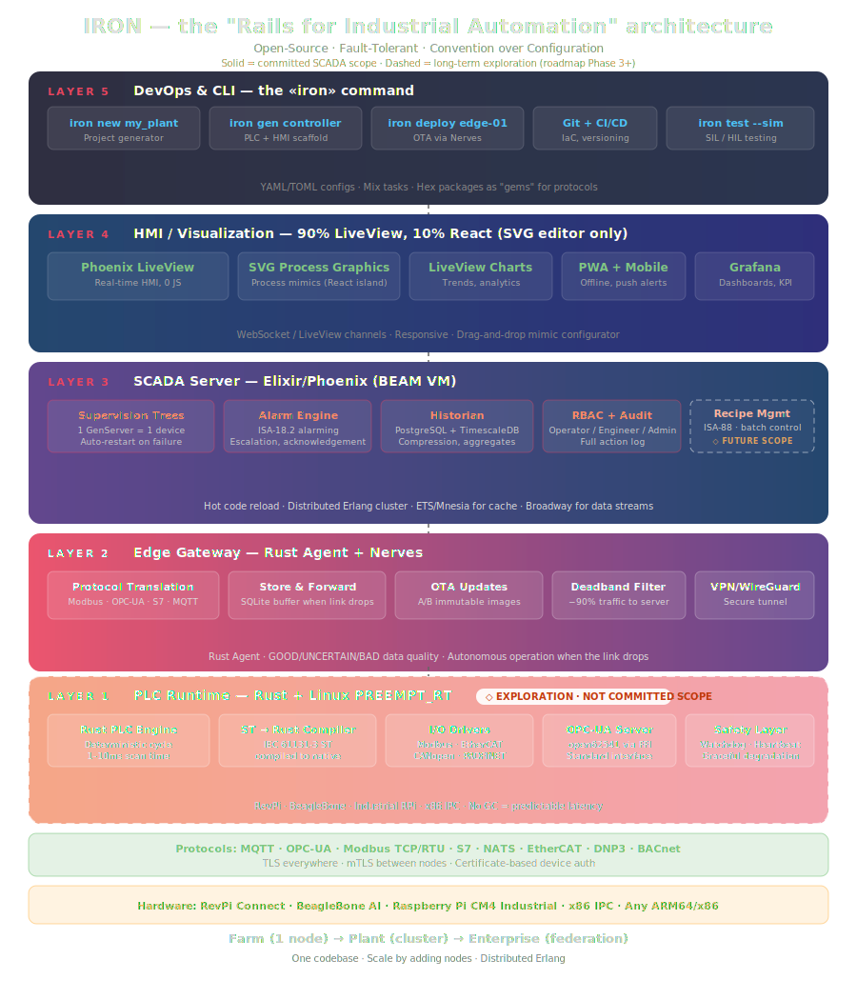

<div align="center">

# ⚙️ IRON

### Industrial automation for the rest of us

**An open-source SCADA and industrial automation platform, designed like modern software:**
Rust at the edge · Phoenix LiveView in the browser · TimescaleDB as the historian ·
one CLI · configuration in Git · simulation before hardware

[](LICENSE)
[](docs/business/roadmap.md)
[](docs/START-HERE.md)
[](CONTRIBUTING.md)

[**Start Here**](docs/START-HERE.md) ·
[Architecture](docs/specs/architecture.md) ·
[Why IRON](docs/vision/problem.md) ·
[vs Ignition / UMH / Node-RED](docs/vision/honest-comparison.md) ·
[Roadmap](docs/business/roadmap.md)

</div>

---

```bash
iron new myplant && cd myplant
iron dev                      # live dashboard with simulated sensors — minutes, not months
iron validate                 # spec errors caught before they reach the plant floor
iron deploy --target local    # zero-downtime deploy to a $150 mini-PC on your LAN
iron field                    # commissioning checklist as a product, results in Git
```

**Monitoring and control for factories, water treatment, greenhouses, and
workshops** — without six-figure licenses, per-tag pricing, Windows-only
runtimes, or a vendor between you and your own plant.

> 📐 **Where the project stands:** IRON is in its architecture phase — this
> repository is a complete engineering blueprint (15 normative specs, 7
> decision records, honest competitive analysis), published openly *before*
> the code, the way serious infrastructure gets built. The prototype
> (`iron new` → Modbus TCP → live dashboard) is the current milestone.
> **This is the best moment to influence the design** — and the earliest
> possible moment to say "I was here before v0.1".

---

## Why this exists

Walk into a typical plant in 2026 and you will find a SCADA system on
Windows XP, configuration in binary files on one aging PC, a historian that
takes minutes to answer simple questions, and an invoice with more zeros than
features. Not because the problem is hard — because the incumbents haven't
felt competitive pressure in twenty years. [The full argument →](docs/vision/problem.md)

IRON applies the Ruby on Rails playbook to industrial automation: assemble
proven technology into one coherent, opinionated, joyful-to-use stack — and
make the right thing the easy thing.

```
PLCs & sensors ──► iron-core ──────► NATS JetStream ──────► iron-web ──► any browser
Modbus·OPC-UA·S7   Rust edge agent   unified namespace      Phoenix LiveView · alarms
                   deadband·buffer   at-least-once·replay   TimescaleDB historian
                   local alarms                             audited command path
```



## What makes it different

| | |
|---|---|
| 🔒 **READ/WRITE separation as architecture** | A dashboard bug *cannot* command a machine — separate code paths, separate broker permissions, separate network rules. [spec →](docs/specs/read-write-separation.md) |
| 🛰️ **Intelligence at the edge** | The Rust agent filters, buffers, and evaluates alarms next to the PLC — and keeps working when the network dies. [spec →](docs/specs/edge-agent.md) |
| 📋 **Specs, not click-marathons** | Tags, alarms, dashboards — plain YAML in Git. Reviewable, diffable, AI-generatable, deterministically validated. [spec →](docs/vision/spec-driven.md) |
| 🧪 **Simulation-first** | Build and test a full plant screen with zero hardware. The simulator is the same binary, not a toy. [spec →](docs/specs/testing.md) |
| ✅ **Commissioning as a product** | `iron field` turns signal checkout — today's Excel-and-paper ritual — into a guided, audited, Git-versioned workflow. **No other platform has this.** [spec →](docs/specs/field-verification.md) |
| 📉 **Drift detection** | `iron diff` proves the plant runs exactly what Git says. Remote fleet maintenance for integrators. [spec →](docs/specs/cli.md) |
| 🏷️ **Unlimited tags, forever** | Apache 2.0. A 40-sensor greenhouse and a 100,000-tag refinery pay the same: nothing. [ADR →](docs/decisions/0005-apache-2-license.md) |

## Built on boring, proven technology

| Layer | Technology | Why |
|---|---|---|
| Edge agent | **Rust** | Memory safety next to PLCs, no GC pauses, single binary, ARM64/x86 — [ADR 0001](docs/decisions/0001-rust-for-edge.md) |
| Message bus | **NATS JetStream** | 15MB binary, subject-level auth, replay, unified namespace — [ADR 0003](docs/decisions/0003-nats-jetstream.md) |
| Server & UI | **Elixir / Phoenix LiveView** | GenServer per tag, supervision trees, real-time UI without a JS framework — [ADR 0002](docs/decisions/0002-elixir-phoenix-liveview.md) |
| Historian | **TimescaleDB** | It's PostgreSQL — full SQL, compression, continuous aggregates, one backup — [ADR 0004](docs/decisions/0004-timescaledb.md) |
| Deployment | **Kamal 2** | One command, health-gated, air-gap friendly, no Kubernetes required — [ADR 0006](docs/decisions/0006-kamal-for-deployment.md) |

Runs on a Raspberry Pi, a $150 fanless mini-PC, or your existing servers.
High availability = two cheap boxes + Patroni, not one expensive box.
[Hardware guide →](docs/guides/hardware.md)

## Who it's for

- 🏭 **Automation engineers** drowning in license renewals and binary config files
- 🔧 **System integrators** who want to own their client relationships, not rent them from a vendor
- 🌱 **Farmers & makers** who deserve plant-grade monitoring at greenhouse prices
- 🦀 **Rust & Elixir developers** looking for distributed-systems problems with physical consequences

Meet [Arman, Zarina, Bakyt and Nikita →](docs/vision/personas.md)

## Honest by policy

This project's documentation rules forbid inflated claims: every performance
number is a cited benchmark or an explicit **target**, the
[competitive analysis](docs/vision/honest-comparison.md) credits Ignition and
UMH where they are better today, and the specs state plainly what IRON is
not (a safety system, for one — [see what IRON does not claim](docs/specs/security.md)).
If you find marketing where engineering should be, open an issue: that's a bug.

## 📚 The knowledge base

The `docs/` tree is a structured knowledge base — plain Markdown, also opens
as an Obsidian vault — written for two readers: **humans** deciding whether to
join, and **LLMs** implementing against normative specs.

```
docs/
├── START-HERE.md        routes: farmer · engineer · developer · LLM
├── glossary.md          shared vocabulary, one definition per term
├── vision/              why — problem, beliefs, personas, honest comparison
├── specs/               what — 15 normative, testable specifications
├── decisions/           why this tech — 7 ADRs with trade-offs
├── business/            model · economics · roadmap
└── guides/              hardware selection · TDD practice
```

## 🤝 Contributing

The most valuable contributions right now are **conversations, not code**:

- **Challenge the architecture** — find the flaw before it's 50,000 lines
- **Lend domain expertise** — tell us what the factory floor knows that we don't
- **Build a proof of concept** — any single spec, implemented and tested
- **⭐ Star the repo** — it's how the next contributor finds this

[CONTRIBUTING.md →](CONTRIBUTING.md)

## License

[Apache 2.0](LICENSE) — own it, fork it, deploy it, build a business on it.

---

<div align="center">

*The tools to build better industrial software finally exist.*
*Someone needs to put them together. If you share that belief — welcome.*

**[Start here →](docs/START-HERE.md)**

</div>
