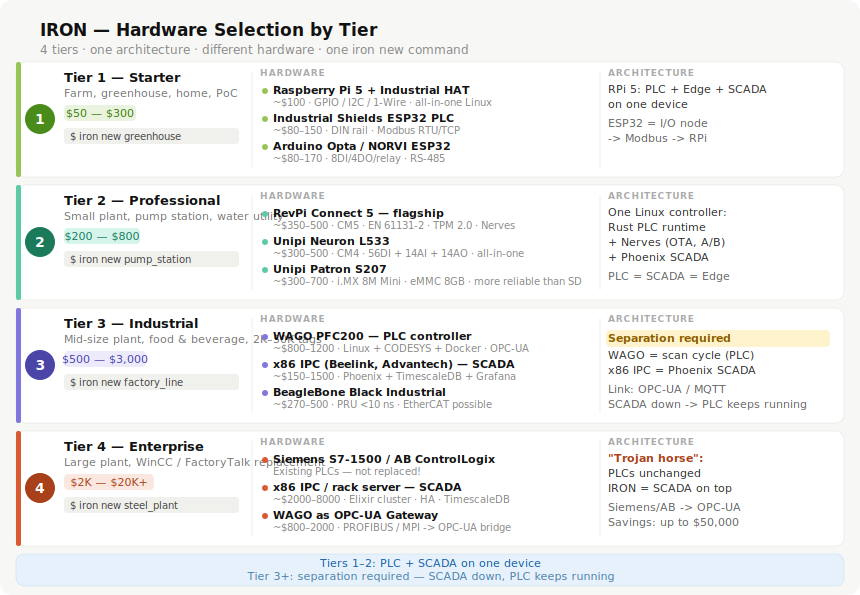

# Hardware Guide



> Interactive diagram: [Hardware Tiers by Level](../assets/hardware-tiers.html)

Traditional SCADA buys expensive proprietary hardware because "it's more
reliable." In reality, reliability comes from **redundancy architecture**, not
from a price tag: two cheap servers with automatic failover beat one expensive
server with one power supply. IRON is the software stack; the hardware is a
commodity.

The one decision that matters most: **where the PLC ends and SCADA begins.**

```
Levels 1–2: everything on one device          Level 3+: mandatory separation
──────────────────────────────────            ─────────────────────────────────
RevPi / Unipi / Raspberry Pi                  PLC (WAGO, Siemens, …)   x86 IPC
 ├── control logic                             scan cycle 1–10ms   →   iron-web
 ├── iron-core edge agent                      safety logic   OPC-UA   historian
 └── iron-web SCADA                            runs if SCADA dies      alarms
Like Rails dev mode: fine for small plants    The reliability contract of any
                                              serious plant: SCADA down ≠ plant down
```

## Level 1 — DIY / maker / small farm ($150–400)

Greenhouse with 10–40 sensors, irrigation, proof of concept, learning.

```
Raspberry Pi 4/5 (industrial enclosure, USB SSD — not SD card!)
  ├── iron-core: reads ESP32 nodes via Modbus RTU, or sensors directly
  ├── iron-web: dashboard on your phone
  └── TimescaleDB

ESP32 PLC nodes per zone (Industrial Shields, Arduino Opta — $80–150, DIN-rail)
  └── Modbus RTU over RS-485, cable runs up to 1,200m
```

A 5-greenhouse farm: one Pi + five ESP32 nodes ≈ $700–1,000 (a comparable
Siemens setup starts around $5,000). Direct sensor connection without Modbus
works too — `i2c://`, `gpio://`, `1wire://`, `spi://` sources via
`linux-embedded-hal` (see [tag model](../specs/tag-model.md)).

**Limitation:** this level is not production-grade — step up to Level 2 when
the greenhouse becomes a business.

## Level 2 — Professional small plant ($300–800)

40–2,000 tags, one device running both control and SCADA. Production-ready,
small enough that one device is acceptable.

**Option A — RevPi Connect 5 (recommended):** CM5 (Cortex-A76), EN 61131-2
certified, EMC per IEC 61000, PREEMPT_RT kernel included, hardware watchdog,
TPM 2.0, 2× GbE (one IT, one OT — physical network split built in),
production guaranteed until 2036. Modular PiBridge I/O: DIO ~$80, AIO ~$120,
relay ~$80, RS-485 ~$60.

**Option B — Unipi Neuron L533 (~$500):** 36 DI + 4 AI + 4 AO + 14 relays +
2× RS-485 in one DIN-rail box; exposes I/O via Modbus TCP, so iron-core needs
no custom driver. The Patron line (eMMC, no SD card) is the production pick.

**Deployment packaging:** Docker + Kamal is the default
([deployment](../specs/deployment.md)); Nerves immutable firmware (A/B
rollback, 5–10s boot) is the advanced option for harsh environments.

## Level 3 — Medium plant ($2,000–8,000)

2,000–50,000 tags, multiple lines, 24/7 uptime. **PLC and SCADA separate —
non-negotiable.**

**PLC: WAGO PFC200** — the German industrial standard. 750-series I/O
(hundreds of variants), CODESYS runtime for control logic, and Linux with
Docker — so iron-core runs *on the PLC*, beside CODESYS:

```
WAGO PFC200
  ├── CODESYS runtime — owns the scan cycle, safety logic, certified
  └── Docker: iron-core — reads I/O locally, publishes to NATS,
              evaluates alarms, buffers on outage
If IRON fails → CODESYS keeps the plant running.
If the SCADA server fails → CODESYS keeps the plant running.
```

(Why IRON recommends CODESYS hardware while criticizing CODESYS licensing:
[ADR 0007](../decisions/0007-codesys-today-iron-plc-later.md).)

**SCADA server:** Beelink EQ12 (~$150) — Intel N100, 16GB, 2× 2.5GbE,
**passive cooling** (fan bearings are a leading cause of edge downtime), 10W.
Recommended: two units + Patroni for PostgreSQL failover under 10 seconds —
real HA for ~$300. For certified/extended-temp needs: Advantech UNO series;
for big historians: any server with ECC RAM and IPMI.

## Level 4 — Large plant: the Trojan horse ($3,000–10,000)

50,000+ tags, existing certified PLC fleet (S7-1500, ControlLogix).
**The principle: never replace the PLC.** Certified controllers stay exactly
as they are; IRON replaces only the proprietary SCADA above them:

```
50× Siemens S7-1500 (unchanged)
   │ OPC-UA (native on S7-1500)
   ▼
x86 IPC: iron-core ──NATS──► x86 IPC: iron-web + TimescaleDB
```

The economics for a 50,000-tag plant: incumbent per-tag licensing reaches
hundreds of thousands of dollars; IRON is $0 in licenses plus a few thousand
in commodity hardware. This is how IRON enters large enterprises — from above
the control layer, with zero regulatory disturbance.

## Special cases

- **CLICK PLUS (~$200)** — a PLC with Linux inside: SSH in and run iron-core
  on the controller itself. Two processes, one device, OS-level isolation.
- **BeagleBone Black Industrial** — its PRU coprocessors (200MHz,
  deterministic, independent of Linux) are the only open-source path to hard
  real-time I/O (<1µs jitter): EtherCAT slave, precise PWM, custom fieldbus.
  -40…+85°C variants exist.
- **ESP32 as distributed I/O** — $80–150 DIN-rail nodes replacing $400+
  remote I/O panels. Never for safety outputs; never above ~100Hz sampling.

## Sensors

**IO-Link (IEC 61131-9)** turns a dumb 4-20mA signal into a smart device:
value + unit + status + serial number + calibration validity + diagnostics.
IFM and Turck are the reference vendors; IFM AL1350 masters output Modbus
TCP/OPC-UA directly — no custom parsing.

**Vibration on a budget:** industrial sensors run $800–1,500; a $15 MEMS
accelerometer (ADXL355) on an ESP32-C3 (RISC-V — Rust via `esp-hal`) delivers
a usable spectrum for predictive monitoring of non-critical motors and pumps,
50–100× cheaper.

## Control cabinet basics

```
ZONE 1  Power: breakers · 24VDC PSU · UPS (even 5 min prevents reboot-into-
        unknown-state after a voltage spike)
ZONE 2  Controller: PLC + managed switch (VLAN 10 OT / VLAN 20 IT — the
        physical form of READ/WRITE separation)
ZONE 3  I/O modules        ZONE 4  Field terminals (labeled, grouped)
ZONE 5  Safety: Pilz E-stop relay — hardwired, independent of everything above
ZONE 6  Door panel: start/stop, optional 7" panel showing the edge agent's
        local fallback page
```

Rules that prevent expensive mistakes: power and signal cables never share a
bundle (interference on analog signals); cabinet fill ≤60–70% at installation
(heat + expansion reserve); E-stop circuits are wired copper, never networked.

**Reference cabinet (~$1,800 total):** enclosure $300–500, breakers + PSU
$150, mini-UPS $200, CLICK PLUS $200, managed switch $150, I/O modules $200,
terminals $100, Pilz relay $150, Beelink EQ12 $150, cables/labels $200.
Comparable Siemens + Weintek + IPC build: $6,000–10,000.

## Decision tree

```
< 500 tags, learning/DIY        → Level 1: Pi + ESP32 nodes
< 2,000 tags, production        → Level 2: RevPi Connect 5 / Unipi
2,000–50,000 tags               → Level 3: WAGO PFC200 + separate x86 server
> 50,000 tags / existing PLCs   → Level 4: keep PLCs, replace SCADA only
Hard real-time (<1ms) needed    → BeagleBone PRU / dedicated hardware
Remote zones on a budget        → ESP32 nodes over RS-485
```

A greenhouse with a $300 RevPi and a refinery with a $5,000 IPC run the same
`iron new`, the same `iron deploy`, the same `iron field`. The configuration
changes. The tool does not.
