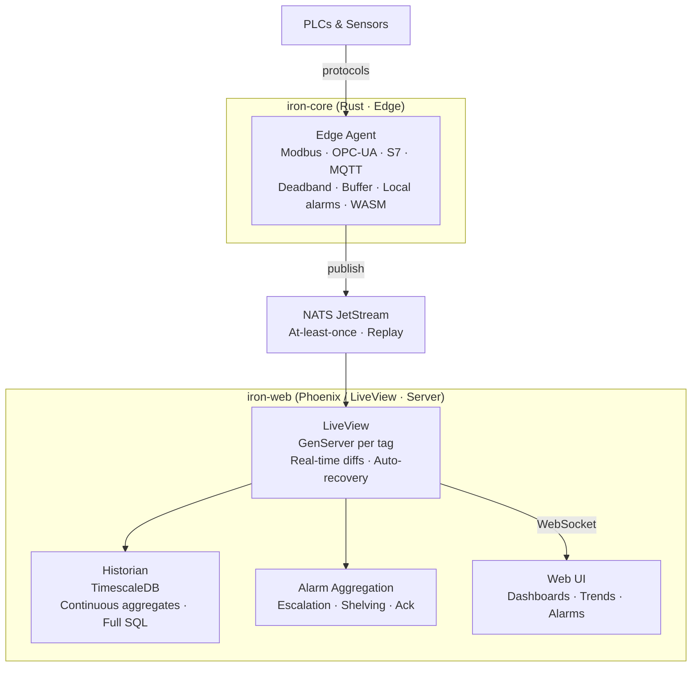

# System Architecture

IRON has a two-layer architecture with a clear boundary between runtime and interface.

```
┌─────────────────────────────────────────────────────────────────┐
│  FIELD LEVEL                                                     │
│  PLCs: Siemens S7 · Allen-Bradley · CLICK PLUS · Soft PLC       │
│  Sensors: IO-Link · 4-20mA · HART · Vibration                   │
│  Protocols: Modbus TCP/RTU · OPC-UA · S7 · MQTT                 │
└───────────────────────────┬─────────────────────────────────────┘
                            │
┌───────────────────────────▼─────────────────────────────────────┐
│  iron-core  (Rust)                                               │
│                                                                  │
│  Edge Agent — see specs/edge-agent.md                            │
│  • Protocol drivers: Modbus, OPC-UA, S7, MQTT                   │
│  • Deadband filtering with alarm-limit override                  │
│  • First-level alarm evaluation (local, autonomous)              │
│  • Data quality: GOOD / UNCERTAIN / BAD                         │
│  • Local SQLite buffer — survives network loss                   │
│  • WASM modules — custom logic without recompiling the agent     │
└───────────────────────────┬─────────────────────────────────────┘
                            │ NATS JetStream
                            │ subject: plant.line1.reactor1.temperature
┌───────────────────────────▼─────────────────────────────────────┐
│  iron-web  (Phoenix / LiveView)                                  │
│                                                                  │
│  • Real-time dashboards — LiveView                               │
│  • SVG mimic editor — React island (design-time only)            │
│  • Tag Engine (GenServer per tag)                                │
│  • Alarm aggregation, escalation, acknowledgment                  │
│  • Historian — TimescaleDB (PostgreSQL + time-series)            │
│  • Command Service — the only WRITE entry point                   │
│  • REST API · WebSocket · RBAC · Audit log                       │
└───────────────────────────┬─────────────────────────────────────┘
                            │ WebSocket
                        Browser / Mobile
```



## Responsibilities

| Component | Owns | Must never do |
|---|---|---|
| Edge agent (iron-core) | Polling, conversion, quality, deadband, buffering, first-level alarm evaluation, executing authorized commands | Originate commands on its own |
| NATS JetStream | Transport between edge and server, replay, at-least-once delivery | Hold business logic |
| iron-web | Visualization, historian, alarm aggregation/escalation, RBAC, audit, Command Service | Bypass the Command Service for writes |
| Browser | Display, operator interaction | Talk to the edge or PLC directly |

## Communication layer

NATS JetStream is the internal message bus between iron-core and iron-web.
The rationale for choosing NATS is in [decisions/0003-nats-jetstream.md](../decisions/0003-nats-jetstream.md).

- Subject hierarchy mirrors physical topology: `plant.line_1.reactor_01.temperature`
- Wildcard subscriptions: `plant.line_1.>` gives you all of line 1
- Replay on reconnect — a restarted iron-web instance catches up from the stream
- Data subjects and command subjects live in **separate authorization scopes** —
  see [read-write-separation.md](read-write-separation.md) and [security.md](security.md)

NATS subjects implement the Unified Namespace concept: every tag has exactly one
canonical address in the system.

## Scaling design

> **Status: design targets.** IRON has no implementation yet. The numbers below
> describe how the architecture is intended to behave, derived from published
> benchmarks of the underlying technologies — not from measurements of IRON itself.

A mid-size refinery has 100,000 tags updating every second. Three filtering layers
make this tractable:

```
Layer 1 — Deadband (Rust edge agent)
  100,000 polls/sec → ~10,000 publishes/sec
  (typical −80–90% for analog tags; digital tags publish only on change)

Layer 2 — GenServer routing (Elixir)
  Each tag = one lightweight Elixir process (~2KB RAM)
  100,000 tags ≈ 200MB RAM
  Updates go only to subscribers of that tag, not broadcast

Layer 3 — Client subscription (LiveView)
  Operator opens a pump station screen
  → subscribes to the 50–200 visible tags only
  → browser receives 50–200 updates/sec, not 10,000
```

An operator viewing a pump station screen receives updates for the tags on that
screen. Not 100,000. This is the difference between correct and naive architecture.

### Reference numbers for the underlying technologies

These are vendor/community published figures for the components in isolation,
under their own benchmark conditions. They bound what is possible; they do not
describe IRON. IRON will publish its own measured numbers when a prototype exists.

| Claim | Source | Caveat |
|---|---|---|
| NATS core: millions of msg/sec | NATS benchmarks | Core NATS, in-memory. JetStream (persistent, at-least-once) is significantly slower — plan around ~100k–1M msg/sec, still far above IRON's needs |
| Phoenix: 2M WebSocket connections | Phoenix team benchmark (2015) | Raw channels on a 40-core/128GB machine. LiveView processes are heavier; IRON targets hundreds of concurrent operators, not millions |
| TimescaleDB: ~1M rows/sec insert | TimescaleDB benchmarks | Batched inserts on server-class hardware |
| TimescaleDB: 8–12× compression | TimescaleDB documentation | Workload-dependent |

## Network topology

```
VLAN 10 (OT): PLCs, sensors, I/O modules — isolated
VLAN 20 (IT): NATS, TimescaleDB, iron-web server
Firewall rule: OT → IT allowed (edge agent initiates connection to NATS)
               IT → OT blocked by default (no unsolicited access to PLCs)

The edge agent initiates the TCP connection to NATS (OT → IT).
Over this established connection, data flows both ways:
  READ:  agent publishes sensor data to data subjects
  WRITE: agent subscribes to its own command subjects, receives authorized commands
```

See [security.md](security.md) for the authorization model that keeps these
two flows separated on a shared broker.

## What runs where

| Hardware | Cost | Use case |
|---|---|---|
| Raspberry Pi CM4 (industrial carrier) | ~$150 | Small plants, greenhouses, up to ~2,000 tags |
| Beelink EQ12 (Intel N100, passive cooling) | ~$150 | Mid-size plants, DIN-rail mounting |
| CLICK PLUS PLC | ~$200 | PLC + edge agent on same hardware (Linux inside) |
| x86 industrial PC | $300–800 | Large plants, demanding workloads |

Full selection guidance: [guides/hardware.md](../guides/hardware.md).
Deployment modes and tooling: [deployment.md](deployment.md).
