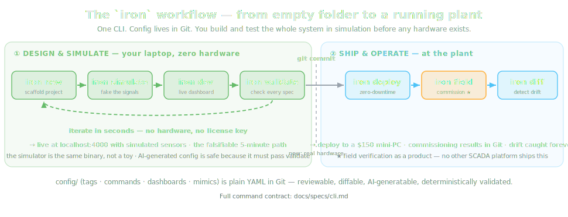

# The `iron` CLI

Every interaction with IRON goes through a single CLI. No GUI configuration
tools that only run on Windows. No vendor IDEs. This document is the contract
for each command.

```
iron new        scaffold a project (--lite: single-device mode, no external services)
iron run        run a lite project as one process tree (Mode 0)
iron dev        run the full stack locally (Docker Compose, simulator on)
iron validate   check every spec against its invariants
iron simulate   define simulated signal sources
iron generate   derive artifacts from specs (tests, scenarios, dashboards, objects)
iron import     generate specs from external sources (IO lists)
iron expand     print effective config after device-type expansion
iron test       run tests (--sim for simulation scenarios)
iron deploy     deploy via Kamal 2 (local server, cloud, edge)
iron migrate    --to-full: convert a lite deployment, history included
iron plugin     add/list/remove WASM extension modules (vendored into Git)
iron diff       show drift between Git config and what is running
iron field      field verification workflow (commissioning)
iron version    versions across all targets
```



Mode 0 (`--lite`, `iron run`, `iron migrate`) contract:
[deployment.md](deployment.md). Plugin contract: [extensions.md](extensions.md).

## iron new

```bash
iron new myplant && cd myplant
iron dev
# → http://localhost:4000 — live dashboard with simulated data
```

The five-minute path, stated falsifiably:

```
00:00  iron new greenhouse && cd greenhouse
00:15  iron simulate --demo greenhouse
00:20  iron dev
00:25  open http://localhost:4000
       → 12 tags, live trend chart, one simulated alarm with ack button
05:00  a working monitoring system, no PLC, no Windows, no license key
```

> **Status: target.** This sequence is the acceptance test for Phase 1; it does
> not exist yet.

Scaffold layout:

```
myplant/
  config/
    tags/            # READ specs
    commands/        # WRITE specs (always separate)
    types/           # device types
    dashboards/      # widget layouts
    mimics/          # SVG mnemonics
    connections.yaml # host aliases
    deploy.yml       # Kamal targets
  test/
    sim/scenarios/
  docker-compose.yml
```

## iron validate

Reads every spec, checks every invariant, exits non-zero on errors.

```bash
iron validate
# ✅ 47 tags valid
# ⚠️  reactor_01.flow — no alarm limits defined
#     hint: a flow tag without alarms will not detect pump failures
# ❌ pump_02.status — source unreachable (connection refused at 192.168.1.11:502)
# ❌ reactor_01.pressure — alarm high_high (220) exceeds range maximum (200)
```

Checks: source URI syntax, alarm limit ordering and range containment, type
constraints, command references, mimic/dashboard tag bindings
(`--mimics`), device-type expansion. Reachability problems are warnings when
the target is expected offline (`--offline`).

This is the contract that makes AI-generated configuration safe:
nothing reaches the plant floor without passing a deterministic validator.
See [vision/spec-driven.md](../vision/spec-driven.md).

## iron simulate

```bash
iron simulate reactor_01 --temperature "sine:20:180:60s"
iron simulate pump_01 --status "cycle:on:30s:off:5s"
iron simulate plant --scenario morning_startup
```

Generators: `sine:min:max:period`, `walk:start:step`, `cycle:...`, `step:...`,
plus scripted scenarios (YAML timelines — see [testing.md](testing.md)).
The simulator is the same iron-core binary with `sim://` sources — not a toy
parallel implementation.

## iron generate

Derives artifacts from specs. Generated files are marked and regenerable;
hand-edited sections survive regeneration or the command refuses.

```bash
iron generate tests reactor_01       # ExUnit stubs from the tag spec
iron generate scenarios reactor_01   # simulation scenarios from alarm specs
iron generate dashboard reactor_01   # default widgets for every tag
iron generate object reactor_01 --template chemical_reactor  # full vertical slice
```

## iron import

```bash
iron import io-list ./IO_List.xlsx --map "Tag No=name, Address=source, ..."
```

Turns the project IO list into validated tag specs. Contract in
[device-types.md](device-types.md).

## iron deploy

Thin wrapper over Kamal 2 ([decisions/0006-kamal-for-deployment.md](../decisions/0006-kamal-for-deployment.md)):
configures the two-container layout (iron-web + iron-core), handles ARM64
cross-builds for edge devices, enforces backwards-compatible migrations.

```bash
iron deploy --target local     # plant server on the LAN (default production mode)
iron deploy --target cloud     # optional VPS
iron deploy --target edge-01   # Raspberry Pi / mini-PC in the OT zone
```

Zero-downtime: the old container keeps running until the new one passes health
checks; failed deploys roll back automatically. Modes and air-gapped
installation: [deployment.md](deployment.md).

## iron diff

Drift detection — the guarantee that Git is not lying about the plant:

```bash
iron diff --target edge-01
# Comparing git HEAD config ↔ running config on edge-01
# ✅ 46 tags identical
# ❌ reactor_01.temperature.deadband: git=0.5, running=0.2
#    deployed 2026-05-02 14:11 by arman@plant.kz (not committed)
```

- Every deploy stamps the running config with its Git SHA.
- `iron diff` MUST detect any divergence between the committed spec and the
  effective running config on every target.
- CI SHOULD run `iron diff` against production nightly and alarm on drift.

For an integrator maintaining eleven plants remotely, this single command
replaces "I hope nobody touched it since March".

## iron field

The commissioning workflow — systematic verification of every physical signal,
with results in Git instead of Excel. Full specification:
[field-verification.md](field-verification.md).

## Conventions all commands follow

- Exit code 0 = success, 1 = validation/test failure, 2 = environment error.
- `--json` on every read command for scripting and AI consumption.
- Destructive or write-capable operations require explicit flags; nothing
  writes to a PLC without `iron field` authorization or a deployed command
  through the WRITE path.
