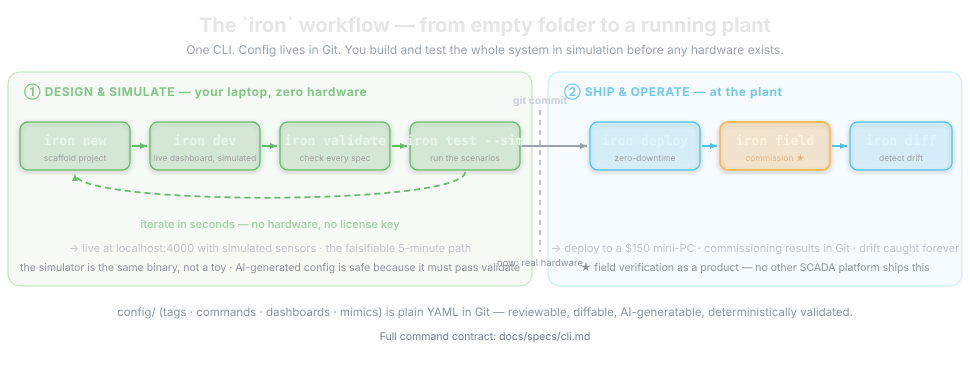

# The `iron` CLI

Every interaction with IRON goes through a single CLI. No GUI configuration
tools that only run on Windows. No vendor IDEs. This document is the contract
for each command.

Seven verbs you use every day:

```
iron new        scaffold a project from a template
iron dev        run it locally: simulator on, hot reload, dashboard on :4000 — nothing else installed
iron validate   check every spec against its invariants
iron test       run tests (--sim for simulation scenarios)
iron deploy     ship to a target (plant · edge-01 · cloud) via Kamal 2
iron field      field verification workflow (commissioning)
iron diff       show drift between Git config and what is running
```

Six you reach for less often:

```
iron generate   derive artifacts from specs: tests · scenarios · dashboard · object · from-io-list
iron explain    answer "where does this go and why" (--effective · --area · --manifest)
iron console    a live REPL against a running site (READ; WRITE only through the Command Path)
iron server     run the server process — what a container or a Pi runs (--role all|ui|core)
iron agent      the agent surface: mcp (serve over stdio) · skill (print the skill file)
iron version    versions across all targets
```

That is the whole surface. `iron` is one binary — CLI, server, simulator, and
MCP server share one core ([ADR 0009](../decisions/0009-rust-for-the-server.md));
every command is also reachable as an MCP tool with the same schema
([agent-interface.md](agent-interface.md)). Commands that were considered
and deliberately left out of v1 — WASM module management, contract diff, split
roles — are in [business/deferred.md](../business/deferred.md) with the
trigger that brings each back.



## iron new

```bash
iron new myplant && cd myplant
iron dev
# → http://localhost:4000 — live dashboard with simulated data
```

The five-minute path, stated falsifiably:

```
00:00  iron new greenhouse --template greenhouse && cd greenhouse
00:10  iron dev
00:20  open http://localhost:4000
       → 12 tags, live trend chart, one simulated alarm with ack button
05:00  a working monitoring system, no PLC, no Docker, no Windows, no license key
```

> **Status: target.** This sequence is the acceptance test for Phase 1; it does
> not exist yet.

Templates (`--template greenhouse | pump_station | workshop | blank`) are the
scaffold-level equivalent of device types: a complete, validated, simulated
starting point for a kind of site, not an empty directory.

`iron new plugin <name> --lang python|rust` scaffolds an out-of-process
extension — declaration, credentialed client, publish loop, test, README —
inside the current project ([extensions.md](extensions.md)). Python is the
skeleton for the audience; Rust is the graduation path into the core.

Scaffold layout:

```
myplant/
  AGENTS.md          # conventions for any agent (and any new human)
  config/
    tags/            # READ specs
    commands/        # WRITE specs (always separate)
    types/           # device types
    dashboards/      # widget layouts
    mimics/          # SVG mnemonics
    connections.yaml # host aliases
    deploy.yml       # Kamal targets (used only when you deploy)
  test/
    sim/scenarios/
```

No `docker-compose.yml` by default: the default deployment is one binary
([deployment.md](deployment.md)). `iron dev --plant` generates one on demand.

**The complexity budget, stated normatively: a project containing only
`config/tags/` is a complete project.** It runs, renders an auto-dashboard
([visual-system.md](visual-system.md)), records history, and raises alarms.
Everything else — commands, device types, custom dashboards, mimics,
plugins — is an optional layer a site adds when it needs it, and no future
feature may introduce a new *required* file. Complexity grows with the
plant, never greets the newcomer.

## iron dev

The default mode plus the simulator plus hot reload. **Watches `config/`**:
a saved YAML file is validated and, if clean, applied live — the dashboard
updates without a restart; if not clean, the diagnostic appears in the browser
overlay and the running configuration is untouched. This is the development
loop the rest of the CLI exists to feed: edit, see, fix, in seconds. Nothing
in `iron dev` can reach a PLC — the simulator is the only source.

Simulated signals are declared in the specs as `sim://` sources or overridden
from the command line:

```bash
iron dev                                            # template's simulation
iron dev --set reactor_01.temperature=sine:20:180:60s
iron dev --scenario morning_startup                 # a YAML timeline from test/sim/scenarios/
iron dev --plant                                    # Compose stack with NATS + TimescaleDB
```

Generators: `sine:min:max:period`, `walk:start:step`, `cycle:...`, `step:...`;
scenarios are YAML timelines ([testing.md](testing.md)). The simulator is
the same `iron-core` code with `sim://` sources — not a toy parallel
implementation.

## iron validate

Reads every spec, checks every invariant, exits non-zero on errors.

```bash
iron validate
# ✅ 47 tags valid
# ⚠️  reactor_01.flow — no alarm limits defined
#     hint: a flow tag without alarms will not detect pump failures
# ❌ pump_02.status — source unreachable (connection refused at 192.168.1.11:502)
# ❌ reactor_01.pressure — alarm high_high (220) exceeds range maximum (200)
#     hint: alarm limits MUST lie inside range — raise range or lower the limit  [IRON-E042]
```

Checks: source URI syntax, alarm limit ordering and range containment, type
constraints, command references, mimic/dashboard tag bindings
(`--mimics`), device-type expansion. Reachability problems are warnings when
the target is expected offline (`--offline`). Diagnostic format:
[agent-interface.md](agent-interface.md).

This is the contract that makes AI-generated configuration safe:
nothing reaches the plant floor without passing a deterministic validator.
See [vision/spec-driven.md](../vision/spec-driven.md).

## iron test

```bash
iron test                    # unit + integration for the project
iron test --sim              # every simulation scenario
iron test --sim --object reactor_01
iron test --driver ./my_plugin --against diagslave   # a protocol driver against a simulator
```

Levels and what each proves: [testing.md](testing.md). `--driver` is the
evidence a community driver brings to be `verified`
([extensions.md](extensions.md)).

## iron deploy

Thin wrapper over Kamal 2 ([decisions/0006-kamal-for-deployment.md](../decisions/0006-kamal-for-deployment.md)):
configures the container layout for the chosen target, handles ARM64
cross-builds for edge devices, enforces backwards-compatible migrations.

```bash
iron deploy --target plant     # LAN server with NATS + TimescaleDB; migrates history from a single-binary site
iron deploy --target edge-01   # the edge role on a Raspberry Pi / mini-PC in the OT zone
iron deploy --target cloud     # optional VPS
```

Zero-downtime: the old container keeps running until the new one passes health
checks; failed deploys roll back automatically. Modes and air-gapped
installation: [deployment.md](deployment.md).

## iron field

The commissioning workflow — systematic verification of every physical signal,
with results in Git instead of Excel. Full specification:
[field-verification.md](field-verification.md).

## iron diff

Drift detection — the guarantee that Git is not lying about the plant:

```bash
iron diff --target edge-01
# Comparing git HEAD config ↔ running config on edge-01
# ✅ 46 tags identical
# ❌ reactor_01.temperature.deadband: git=0.5, running=0.2
#    deployed 2026-05-02 14:11 by arman@plant.kz (not committed)
```

- Every deploy stamps the running config with its Git SHA.
- `iron diff` MUST detect any divergence between the committed spec and the
  effective running config on every target.
- CI SHOULD run `iron diff` against production nightly and alarm on drift.

For an integrator maintaining eleven plants remotely, this single command
replaces "I hope nobody touched it since March".

## iron generate

Derives artifacts from specs. Generated files are marked and regenerable;
hand-edited sections survive regeneration or the command refuses.

```bash
iron generate tests reactor_01       # Rust test stubs from the tag spec
iron generate scenarios reactor_01   # simulation scenarios from alarm specs
iron generate dashboard reactor_01   # default widgets for every tag
iron generate object reactor_01 --template chemical_reactor  # full vertical slice
iron generate from-io-list ./IO_List.xlsx
```

`from-io-list` turns the project IO list into validated tag specs. Column
mapping is interactive by default — the command guesses from headers and
confirms ("column 'Tag No' → name? [Y/n]"); the `--map "Tag No=name, ..."`
flag exists for CI and scripts, never as the thing a human must learn first.
Contract
in [device-types.md](device-types.md).

## iron explain

One question, one command. The answer is a subgraph of the derived plant
manifest ([agent-interface.md](agent-interface.md)), not prose.

```bash
iron explain reactor_01.temperature
# source      modbus://plc-01/holding/0x1000  scan 1s  deadband 0.5 (type default 0.2 overridden)
# alarms      high 180 (p2) · high_high 195 (p1)
# shown on    dashboards/reactor_01.yaml (gauge, trend) · mimics/reactor.svg
# consumed by plugin vibration-ml
# historian   raw 30d → 1m aggregates 2y
iron explain --effective            # the whole config after device-type expansion
iron explain --area reactor_01      # a compact pack for one area: what an agent or a reviewer needs
iron explain --manifest > plant.json
```

## iron console

A live REPL attached to a running site — the thing developers otherwise
replace with throwaway scripts:

```
iron console --target plant
iron> tags.reactor_01.temperature        # {value: 87.5, quality: GOOD, ts: ...}
iron> alarms.active                      # the ISA-18.2 view, live
iron> history("reactor_01.temperature", last: "1h").describe()
iron> sim.set("reactor_01.temperature", 190)        # only when the target runs the simulator
iron> commands.pump_01.start()           # goes through the Command Path: auth, journal, audit — or is refused
```

The console has no privileged path: reads are reads; a write is a command,
and the command path decides ([command-path.md](command-path.md)).

## iron server

What a container, a Pi, or a systemd unit runs. `--role all` (default) is
the single-binary site; `--role ui` / `--role core` exist for the deferred
split deployment ([deferred.md](../business/deferred.md)).

## iron agent

```bash
iron agent mcp       # serve validate · explain · generate as MCP tools over stdio
iron agent skill     # print the IRON skill file (also shipped in the scaffold)
```

Same core, same schemas, same diagnostics as the CLI. There is no MCP tool
for commands, `field`, or `deploy`. Contract and v1 scope:
[agent-interface.md](agent-interface.md).

## Conventions all commands follow

- Exit code 0 = success, 1 = validation/test failure, 2 = environment error.
- `--json` on every read command for scripting and AI consumption.
- Destructive or write-capable operations require explicit flags; nothing
  writes to a PLC without `iron field` authorization or a deployed command
  through the WRITE path.
